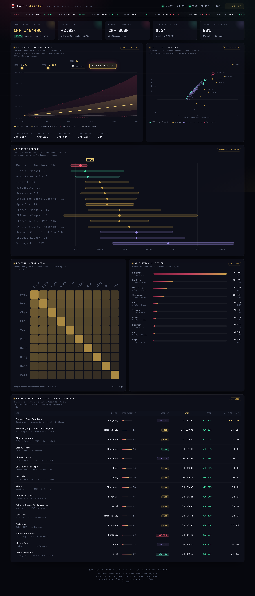

<div align="center">

# 🍷 Liquid Assets™

### *Institutional-grade portfolio intelligence for the world's most illiquid liquid asset.*

**A citizen-development demo** — the kind of app a business person at a private bank
"vibe-codes" to solve a very real, very high-net-worth problem: *should I drink it, hold it, or sell it?*



</div>

---

## The pitch

The **Passion-Asset Desk** of a private bank manages the fine-wine cellars of ultra-high-net-worth
clients as a genuine asset class. Wine is, after all, a *liquid* asset — one that appreciates,
matures, and eventually must be either monetised or, tragically, *enjoyed*.

**Liquid Assets™** treats a wine cellar exactly like a hedge-fund portfolio. Its **Œnometric Engine™**
runs real quantitative finance over the collection and hands the relationship manager a verdict for
every lot: **LAY DOWN · HOLD · SELL · DRINK NOW · PAST PEAK** — complete with the *Cost of the Cork™*,
the expected appreciation you forfeit by pulling the cork today.

> The business value is, of course, **astronomically high.** A single mis-timed Romanée-Conti can
> cost more than a junior banker's annual bonus.

---

## What it demonstrates (the boring, important part)

This is a compact but complete **Python + React full-stack** reference app:

| Requirement | How it's met |
| --- | --- |
| **Reads/writes files to a local dir** | The entire "database" is JSON under `DATA_DIR` — `cellar.json` (the portfolio) and `market.json` (a live-drifting index feed). Atomic writes. Point `DATA_DIR` at a mounted volume in production. |
| **Uses Pydantic** | Every entity and API payload is a Pydantic v2 model — validated on the way in *and* out, with cross-field validators (e.g. the drinking window must be coherent). |
| **Exposes an API** | A FastAPI service with cellar CRUD, portfolio analytics, a Monte-Carlo engine, an efficient-frontier solver, and a market feed. Interactive docs at `/docs`. |
| **Impressive React frontend** | A dark "Bloomberg-terminal-meets-mission-control" dashboard that consumes the API and makes 15 bottles of wine look like the Manhattan Project. |

### The engine is doing genuine maths

No hand-waving — and no heavy dependencies (the linear algebra is hand-rolled, so it runs anywhere):

- **Monte-Carlo valuation cone** — correlated geometric-Brownian-motion simulation of every held region, with a **Cholesky-factorised** correlation matrix driving the shocks.
- **Markowitz efficient frontier** — thousands of random long-only portfolios sampled on the simplex, with the efficient envelope extracted and the client's actual cellar plotted against it.
- **Asymmetric-Gaussian drinkability curve** — a maturity model peaking at each wine's *apogee*, stretched for larger formats (magnums really do age more slowly).
- **Portfolio metrics** — Cellar Alpha vs. the Liv-ex 100, Sharpe ratio, parametric Value-at-Risk, a Herfindahl-based diversification score, and a 10-year projected AUM.

---

## Architecture

```
example-python-fullstack/
├── backend/                 FastAPI + Pydantic — the Œnometric Engine
│   ├── app/
│   │   ├── main.py          API routes; also serves the built SPA in prod
│   │   ├── models.py        Pydantic domain + response models
│   │   ├── engine.py        Monte Carlo, Cholesky, frontier, drinkability
│   │   ├── repository.py    Atomic JSON file store (the "database")
│   │   ├── market.py        Persistent random-walk market feed
│   │   ├── seed.py          The (tastefully over-the-top) demo cellar
│   │   └── config.py        DATA_DIR / FRONTEND_DIST via env
│   └── requirements.txt
├── frontend/                React + Vite + TypeScript dashboard
│   └── src/components/       Hand-rolled SVG charts, no chart library
├── Dockerfile               Multi-stage: build frontend → serve from Python
└── Makefile                 install / dev / build / run / docker
```

In **production** a single Python process serves both the API (`/api/*`) and the built React app
(everything else) — one container, one port. In **development** the API runs on `:8000` and Vite on
`:5173`, proxying `/api` across.

---

## Quick start

### Local (two dev servers)

```bash
make install          # backend venv + npm install
make dev              # API on :8000, Vite on :5173  → open http://localhost:5173
```

Or run the pieces yourself:

```bash
# backend
cd backend && python3 -m venv .venv && ./.venv/bin/pip install -r requirements.txt
./.venv/bin/uvicorn app.main:app --reload --port 8000     # docs at /docs

# frontend
cd frontend && npm install && npm run dev
```

### Production (single process)

```bash
make run              # builds the frontend, then serves everything from FastAPI on :8000
# → open http://localhost:8000
```

### Docker

```bash
make docker-build
make docker-run       # http://localhost:8000, data persisted in a named volume
```

---

## API

Base path `/api`. Full interactive documentation at `/docs`.

| Method | Path | Purpose |
| --- | --- | --- |
| `GET` | `/api/health` | Liveness probe |
| `GET` | `/api/cellar` | List the cellar |
| `POST` | `/api/cellar/bottles` | Add a lot (writes to disk) |
| `GET` | `/api/cellar/bottles/{id}` | One lot, fully analysed |
| `PATCH` | `/api/cellar/bottles/{id}` | Update a lot |
| `DELETE` | `/api/cellar/bottles/{id}` | Remove a lot |
| `POST` | `/api/cellar/reset` | Restore the demo cellar |
| `GET` | `/api/analytics/portfolio` | Cellar-wide metrics (alpha, Sharpe, VaR…) |
| `GET` | `/api/analytics/bottles` | Per-lot verdicts & Cost-of-the-Cork™ |
| `GET` | `/api/analytics/frontier` | Markowitz efficient frontier |
| `GET` | `/api/analytics/correlation` | Regional correlation matrix |
| `POST` | `/api/engine/simulate` | Correlated-GBM Monte-Carlo cone |
| `GET` | `/api/market/pulse` | Live-drifting index feed |

### Configuration

| Env var | Default | Meaning |
| --- | --- | --- |
| `DATA_DIR` | `backend/data` | Where the JSON store lives — point at a mounted **volume** in prod |
| `FRONTEND_DIST` | `frontend/dist` | Built SPA to serve from the API process |
| `PORT` | `8000` | Honoured by the container entrypoint |

---

## Deployment

The app has no platform-specific coupling — it's a standard Dockerfile plus a standard Python/Node
build. Deploy it to anything that runs a container or builds a repo: mount a volume at `DATA_DIR` so
the cellar survives restarts, and you're done.

---

<div align="center">

**For demonstration only.** Not investment advice, and definitely not a substitute for actually
drinking the wine. *Past performance is no guarantee of future vintages.*

</div>
